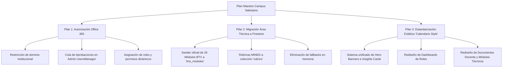

# Plan Maestro: Estandarización Estética, Migración a Firebase y Autorización Office 365

## 1. Diagnóstico de la Situación Actual

1. **Autorización y Onboarding de Usuarios:**
   - Actualmente conviven dos flujos: detección automática en el login (self-healing con cuentas huérfanas) y aprobación manual de solicitudes (`ApprovalRequest` en `UsersManager`).
   - El objetivo requerido es que los usuarios que inicien sesión con sus cuentas de **Office 365** (`@salesianosanjose.edu.sv`) queden en estado pendiente hasta ser validados y autorizados desde el Admin Panel, asociándolos a su rol real (docente, alumno con grado/sección, coordinación, etc.).

2. **Datos Hardcodeados vs Base de Datos (Firebase):**
   - El **Área Técnica** (26 módulos de Bachillerato Técnico Vocacional, rúbricas de competencias MINED, etapas de la acción completa, descriptores) reside actualmente en archivos estáticos (`src/services/btvCurriculumData.ts`).
   - El calendario ya dio el salto con `calendarFirestore.ts` e `InstitutionalCalendar.tsx` (colección `institutional_calendar`), pero las áreas de módulos técnicos y cursos LMS aún dependen de semillas estáticas o fallbacks en memoria.

3. **Disparidad Estética (Design Inconsistency):**
   - **Referente de excelencia:** `InstitutionalCalendar.tsx` (Hero banner oscuro estilizado con gradientes slate/blue, badges con micro-bordes luminosos, tabs de navegación segmentados con pills, tarjetas con métricas en grid `bg-slate-900/80`, tipografía `font-display` y contrastes definidos).
   - **Áreas descuidadas / desordenadas:**
     - Dashboards de coordinaciones secundarias (`CoordinacionDashboard.tsx`, `RegistroDashboard.tsx`, etc.): solo un grid simple sin insights ni métricas clave.
     - Vistas de documentos técnicos y módulos del docente: mezcla de tablas HTML planas, cards simples y modales con márgenes disparejos.
     - `NotasView.tsx` y `ModulePlaceholder.tsx`: componentes con datos de muestra rígidos y aspecto plano.

---

## 2. Los 3 Pilares del Plan de Trabajo

---

## 3. Desglose Detallado por Fases

### Fase 1: Flujo de Autorización y Cuentas Office 365
- **Objetivo:** Ningún usuario no autorizado debe navegar en el sistema; las cuentas institucionales deben esperar la validación del Admin.
- **Acciones:**
  1. **Ajuste en `AuthContext.tsx`:**
     - Cuando un usuario se autentica vía Microsoft/Google con correo `@salesianosanjose.edu.sv`, si no existe en la colección `users`, se crea con `status: 'pending'` y se emite su `ApprovalRequest`.
     - Si su estatus es `pending`, mostrar pantalla estilizada de espera con branding institucional y estado de solicitud en tiempo real (sin entrar a dashboards).
  2. **Refuerzo en `UsersManager.tsx`:**
     - Tab de "Aprobaciones Office 365" con acciones rápidas: aprobar como Docente (seleccionando profesor de la lista), como Alumno (vinculando carnet/grado) o rol administrativo.
     - Sincronización inmediata de permisos y notificación.

### Fase 2: Migración del Área Técnica a Firebase Firestore
- **Objetivo:** Cero datos técnicos quemados en código estático; todo editable y sincronizado desde la nube.
- **Acciones:**
  1. **Script de Seed Cloud:**
     - Migrar la estructura de los 26 módulos técnicos desde `btvCurriculumData.ts` a la colección `lms_modules`.
     - Migrar descriptores, etapas de la acción completa y rúbricas oficiales (1 a 5 con los 4 ejes MINED) a colecciones Firestore.
  2. **Refactorización de Servicios:**
     - Ajustar `lmsService.ts` y `TeacherModules.tsx` para leer exclusivamente de Firestore.
     - Eliminar el fallback inseguro que cargaba módulos de otros docentes si la consulta venía vacía.
     - Permitir que el Administrador o la Coordinación Técnica puedan crear o editar módulos directamente desde la base de datos.

### Fase 3: Estandarización Estética Global (Estilo "Calendario Institucional")
- **Objetivo:** Elevar todas las pantallas al estándar visual de `InstitutionalCalendar.tsx`.
- **Componentes y Patrones a Replicar:**
  1. **Hero Header Premium Unificado (`InstitutionalHeroBanner.tsx`):**
     - Fondo `bg-gradient-to-br from-slate-950 via-slate-900 to-slate-950` con borde `border-slate-800`.
     - Insignia superior con pill brillante (`bg-blue-500/20 text-blue-300 border border-blue-400/30`).
     - Grid inferior de métricas clave con cajas oscuras (`bg-slate-900/80 border border-slate-800`), números con tipografía gruesa y etiquetas claras.
  2. **Navegación Segmentada (Pill Tabs):**
     - Barra de navegación tipo segmented control con botones redondeados `rounded-xl`, bordes suaves y estados activos con sombras delicadas.
  3. **Aplicación por Áreas:**
     - **Dashboards de Coordinación:** Transformar las vistas vacías (`AcademicaDashboard`, `PrimariaDashboard`, `ConvivenciaDashboard`) agregando tarjetas estadísticas interactivas y accesos directos estructurados.
     - **Módulo de Notas y Horarios:** Sustituir la maqueta plana con tablas filtrables dinámicas, selector de periodos y diseño consistente con las tablas de semanas del calendario.
     - **Documentos Docente (Guiones y Planificaciones):** Reemplazar los controles toscos por paneles de edición con el mismo acabado pulido de `SuspensionesManager`.

---

## 4. Prioridad y Orden de Ejecución Sugerido

| Paso | Tarea | Impacto |
|---|---|---|
| **1** | Corregir inconsistencia del permiso `'lms'` en Firestore para docentes y eliminar fallback de fuga de datos en `TeacherModules`. | Estabilidad y Seguridad |
| **2** | Robustecer el flujo de validación Office 365 (login bloqueado hasta aprobación en `UsersManager`). | Control de Acceso |
| **3** | Migrar los 26 módulos técnicos y rúbricas MINED de `btvCurriculumData.ts` a Firestore (`lms_modules`). | Datos Dinámicos |
| **4** | Crear el componente reutilizable de encabezado/hero y rediseñar los Dashboards de Docente y Coordinaciones con el estilo del Calendario. | Estética y Experiencia |
| **5** | Pulir la interfaz de Guiones de Clase, Planificación Didáctica y Notas. | Acabado Premium |
